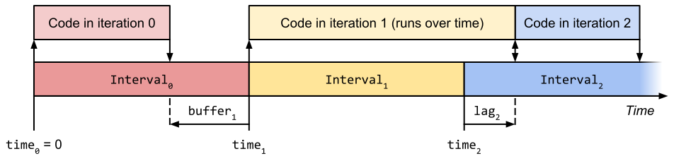

# interval-timer

**interval-timer** is a Python package that enables iterating over a sequence of regular time intervals with high precision.

## Installation

Install from [PyPI](https://pypi.org/project/interval-timer/) via:

```shell
pip install interval-timer
```

## Usage

Basic usage is as follows:

```python
from interval_timer import IntervalTimer

for interval in IntervalTimer(0.5):
    print(interval)
    
    # Execute code exactly every half second here
    ...
```

Output:

```
Interval(index=0, time=0.000, lag=0.000)
Interval(index=1, time=0.500, lag=0.000)
Interval(index=2, time=1.000, lag=0.000)
...
```

For more usage examples see [examples/](examples).

## Description

`IntervalTimer` is an iterator object that returns `Interval` objects at regular time intervals. Code can then be executed upon each time interval, and the intervals will stay synchronised even when the code execution time is non-zero.

`IntervalTimer` is a more precise replacement for a for loop that contains a wait. The following code:
    
```python
from time import sleep

# Iterates approximately every half second
for i in range(5):
    print(i)
    sleep(0.5)
```

can be replaced with:

```python
from interval_timer import IntervalTimer

# Iterates exactly every half second
for interval in IntervalTimer(0.5, stop=5):
    print(interval)
```

**interval-timer** uses [perf_counter](https://docs.python.org/3/library/time.html#time.perf_counter) under the hood to obtain high precision timing. It will not suffer from drift over long time periods.

If an interval iteration is delayed due to slow code execution, then future intervals will still be synchronised to absolute time if they're given time to catch up. The caller can see if synchronisation has been temporarily lost by checking if the `Interval` object's `lag` attribute returns a non-zero value (see the [lag.py](examples/lag.py) example).

## Timing diagram



The above timing diagram shows that each `Interval` object has the following attributes:
- `time`: the nominal start time of the interval. Always has equal value to the `end_time` value of the previous interval.
- `buffer`: the length of time before the interval start time that the interval was requested. The minimum buffer is zero.
- `lag`: The length of time after the interval start time that the interval was requested. The minimum lag is zero. If the lag is non-zero, then the code executed within the previous interval took longer than the interval period, which is generally undesirable.
